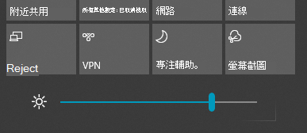

# 在 Windows 10 中變更螢幕亮度Change screen brightness in Windows 10

如果您的 Windows 10 比版本 1903 新，則會在控制中心中顯示**亮度滑桿**。If your Windows 10 is newer than version 1903, it has a **Brightness slider** in the action center. 若要開啟控制中心，請按一下工作列最右側的 [通知 **]** 按鈕，或按鍵盤上的 **Windows 鍵 + A**。To open the action center, click the **Notification** button at the rightmost side of your taskbar, or press **Windows home + A** on your keyboard.

如果您的 Windows 10 是較舊的版本，則可以移至 **[[設定] > [系統] > [顯示]](ms-settings:display?activationSource=GetHelp)**，以找出 [亮度] 滑桿。If your Windows 10 is an earlier version, you can find the brightness slider by going to **[Settings > System > Display](ms-settings:display?activationSource=GetHelp)**.

**附註**：**Notes**:

- 在具有外部監視器的桌上型電腦上，您可能不會看到內建顯示滑桿的 [變更亮度]。You might not see the Change brightness for the built-in display slider on desktop PCs that have an external monitor. 若要變更外部監視器的亮度，請使用監視器上的控制按鈕。To change the brightness of an external monitor, use the controls on the monitor.
- 如果您沒有桌上型電腦，且滑桿沒有顯示或無法運作，請嘗試更新顯示驅動程式。If you don't have a desktop PC and the slider doesn't appear or work, try updating the display driver. 在工作列上的搜尋方塊中，輸入**裝置管理員**，然後從結果清單中選取 [裝置管理員 **]**。In the search box on the taskbar, type **Device Manager**, and then select **Device Manager** from the list of results. 在 [裝置管理員 **]** 中，選取 [顯示卡 **]**，然後選取顯示卡。In **Device Manager**, select **Display adapters**, then select the display adapter. 按住 (或以滑鼠右鍵按一下) 顯示卡名稱，然後按一下 [更新驅動程式 **]**，然後遵循指示進行。Press and hold (or right-click) the display adapter name and click **Update driver**; then follow the instructions.
