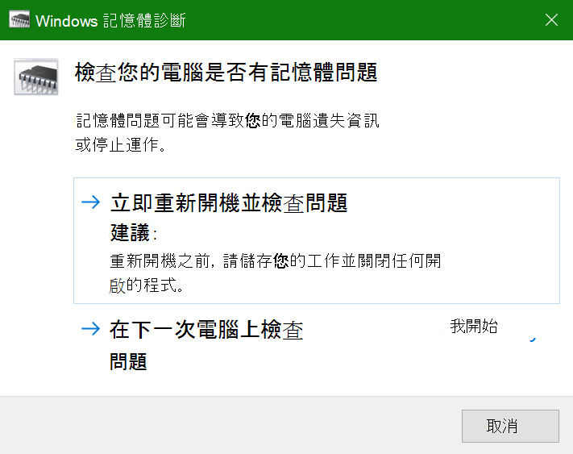

# 在 Windows 10 中執行 Windows 記憶體診斷

如果您電腦上的 Windows 和應用程式當機、凍結，或運作不穩定，則您的電腦記憶體 (RAM) 可能有問題。 您可以執行「Windows 記憶體診斷」來檢查電腦 RAM 的問題。

在工作列上的搜尋方塊中，輸入 **記憶體診斷**，然後選取 [Windows 記憶體診斷]。 

若要執行診斷，需要將電腦重新開機。 您可以選擇立即重新開機 (請先儲存您的工作，然後關閉開啟的文件和電子郵件)，或將診斷程式安排在下次電腦重新開機時自動執行：

當電腦重新開機時，**Windows 記憶體診斷工具** 將會自動執行。 診斷程式執行時會顯示狀態和進度，而且您可以選擇按下鍵盤上的 **ESC** 鍵來取消診斷程式。

當診斷程式完成時，Windows 會正常啟動。
緊接在電腦重新開機之後，桌面出現時，系統會顯示通知 (在工作列上的 [重要訊息中心] 圖示旁)，以指出是否發現任何記憶體錯誤。 例如：

重要訊息中心圖示如下：  

而這是一個通知範例： 

如果您錯過了通知，您可以選取工作列上的 [重要訊息中心] 圖示以顯示 **動作中心**，並查看可捲動的通知清單。

若要檢閱詳細資訊，請在工作列上的搜尋方塊中輸入 **事件**，然後選取 [事件檢視器]。 在 [事件檢視器] 的左側窗格中，瀏覽至 [Windows 記錄] > [系統]。 在右側窗格中，在清單中向下瀏覽，然後查看 [來源] 欄，直到您看到 [來源] 值為 **MemoryDiagnostics-Results** 的事件。 將這類事件強調顯示，並在清單下方下 [一般] 索引標籤下的方塊中查看結果資訊。
